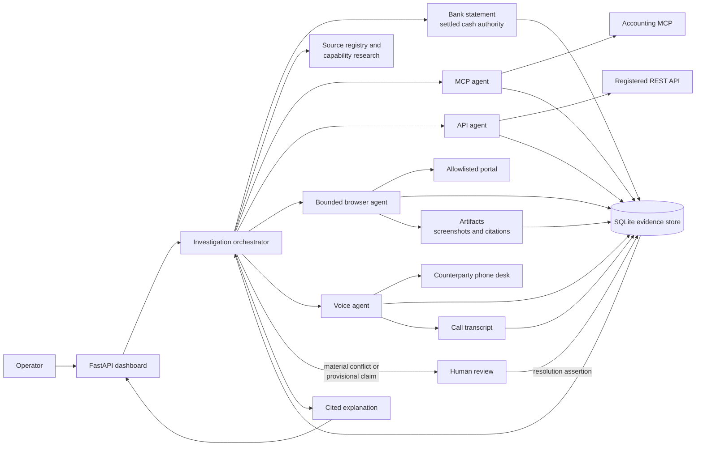

# Cashe

Evidence layer for the MONEY TALKS hackathon. Starts from an authoritative bank statement, then uses an LLM orchestrator to gather operational context from MCP, API, a bounded browser, and a voice caller.

Cashe answers questions such as *Why did cash decrease?* by working outward from settled bank activity. It gathers claim-level evidence from the best authorized source, keeps conflicting claims side by side, and pauses for a human when the records cannot safely be reconciled automatically.

## Agents

The orchestrator decides what evidence is missing and delegates acquisition to a narrowly scoped agent. The order MCP → API → browser → voice is a preference for the first inquiry, not a fixed workflow; the orchestrator can use several agents when a fact needs corroboration.

| Agent | Responsibility | Tools and authority |
| --- | --- | --- |
| **Investigation orchestrator** | Loads the bank statement, identifies missing facts, researches available source capabilities, delegates collection, compares assertions, creates review packets, and writes the cited explanation. | Can inspect the source registry, use Tavily for capability research, spawn acquisition agents, and request human review. Tavily findings never become financial assertions. |
| **MCP agent** | Reads authoritative accounting records such as open invoices, expected receipts, customers, and invoice details. | Uses only the authorized accounting MCP operations. Accounting records are `BOOKS` authority. |
| **API agent** | Retrieves status, timelines, delays, and reasons from a registered financial system with a usable developer API. | Uses allowlisted read operations for API-entitled sources. |
| **Browser agent** | Finds records in authorized portals that do not expose a suitable API, then captures visible fields, timelines, citations, and screenshots. | Uses OpenAI for semantic action selection and Playwright for navigation. The host enforces exact origins, read-only paths, action budgets, identity checks, and completeness checks. Approved SOP memory is browser-only. |
| **Voice agent** | Calls a counterparty when no stronger digital record is available and returns the full transcript. | Uses the configured telephony provider. Voice claims have `COMMUNICATION` authority and remain provisional until corroborated or accepted by a human. |

Acquisition agents cannot create other agents or resolve disagreements. They return evidence to the orchestrator, which owns synthesis and escalation.

## Architecture



Every source result is stored as an artifact plus individual assertions with provenance and authority. Disagreement is retained rather than overwritten. A human resolution becomes a new assertion, so the final explanation can show exactly which evidence supports each claim.

The browser path is intentionally bounded: OpenAI chooses among visible, semantic actions, while application code controls which source, origin, route, query field, and HTTP method may be used. This makes it useful for financial portals and public-record systems without granting arbitrary web access. New portal types are added through a source-registry entry and a browser profile; see [Browser agent](docs/browser-agent.md).

Evidence layer for the MONEY TALKS hackathon. Starts from an authoritative cash result. Everything else is an assertion.

## The story

Finance already knows what settled. The bank statement is not the mystery. The mystery is why: which invoice, which portal, which legal entity, which call. That evidence lives in five systems that disagree. A normal agent averages them into a paragraph.

Cashe does not average. It starts from the authoritative cash result and treats every other source as a claim. MCP, API, browser, voice. Conflicts stay on the board. Voice is provisional. A human only sees a packet after every authorized path is exhausted.

The live demo is September cash down $620k. Three expected receipts. Three channels. One legal-entity fight Cashe refuses to paper over.

That is the product. The experiment is whether the same method still works when the corpus is a real bankruptcy, not a mock ERP.

First Brands Group filed Chapter 11 in the Southern District of Texas. The public story is easy: founder indicted, about $2.7 billion of fake receivables, a June 2025 invoice walked from $8,976 to $463,735. A chat agent stops there. That is a category. You cannot act on a category. You cannot ask “who knew, on what day, and what cash moved after.”

Cashe looks for a collision — two exclusive dollar structures on the same invoice, dated, hashed to a primary the indictment does not recite.

On September 22, 2023, Katsumi asked First Brands for copies of seven invoices it had already funded. On September 25 a Romania AR analyst sent them without routing through the usual gatekeepers. None of the seven matched. The extreme pair: an invoice worth **$240.35** had been funded as **$434,997.58**. Katsumi escalated on September 27. Thereafter it funded about **$4.9 billion more**.

That is the significant part. According to the CRO’s declaration, a sophisticated factor **saw the collision almost two years before the indictment’s example and the machine kept running**. $240.35 is the control failure. **$4.9 billion is the subsequent funding exposure.** That is the unit finance actually uses: a dated disagreement between books and funding, plus the cash that moved after someone compared them. A recap cannot name that date. A collision can.

Hashed: CRO confirmation declaration, Dkt. 3188 ¶ 86, in [`data/research/first-brands/RESULT.json`](data/research/first-brands/RESULT.json). Discriminating files stay sealed. Allegations stay allegations. We did not beat DOJ’s private file. We showed what an evidence layer is for.

## 90-second demo script

**[0:00 — Opening]**

We chose the money-operations track, but we did not want to prove our idea on a synthetic benchmark. So we started with the First Brands bankruptcy, where prosecutors allege billions of dollars in fake receivables, and asked a narrow, harder question on financial analysis: **could we reconstruct the moment the warning became knowable?**

Cashe is a multi-agent orchestrator. It decides what evidence is missing, then dispatches Tavily research, MCP, API, browser, and voice agents. Only acquired records become evidence, and conflicting claims stay separate.

We found a **seven-for-seven control failure** almost two years before the indictment’s example: every invoice Katsumi tested failed to match First Brands’ books. The starkest collision was **$240.35 on the books versus $434,997.58 funded**. After Katsumi escalated the discrepancy, roughly **$4.9 billion in additional funding** followed. The result identifies when the risk became observable and quantifies the exposure that came afterward.

Cashe surfaced the dated mismatch, the primary evidence behind it, and the **$4.9 billion funded afterward**.

**[1:00 — Run the demo: ask “Why did cash decrease in September?”]**

Now watch that orchestrator explain a $620,000 cash decline across MCP, API, browser, and voice.

**[As the evidence appears]**

It finds a missing PO, an entity conflict, and a provisional voice claim—then pauses for a human instead of inventing certainty.

**[1:25 — Show the evidence board and close]**

Cashe is not another agent that summarizes financial data. It shows **what happened, when the warning became knowable, and what money remained at risk**.

## Run

```bash
uv sync
uv run playwright install chromium
uv run uvicorn cashe.main:app --host 127.0.0.1 --port 8000
```

Open http://127.0.0.1:8000 and ask why cash decreased in September.

Full investigation against Prism (records demo human resolutions when the agent escalates):

```bash
uv run python -m cashe.demo
```

## Test

Run the full test suite:

```bash
uv sync --extra dev
uv run pytest -q
```

Exercise the real Chromium acquisition and application integration without an OpenAI call:

```bash
uv run python scripts/smoke_browser.py --scripted
```

For live OpenAI navigation, set `OPENAI_API_KEY` and run the same command without `--scripted`. To write a browser result into the normal Cashe database, start the application, click **Test browser** on the dashboard, and open the investigation returned by the job. The current BluePeak demo uses invoice `INV-BP-2088`. More detail is available in [Browser agent setup and verification](docs/browser-agent.md).

## Config

Copy `.env.example` to `.env`. `PRISM_API_KEY` is required for the live orchestrator. `TAVILY_API_KEY` enables live source-capability research; Tavily falls back to the committed cache when the key is absent or a live call fails.

The browser agent uses OpenAI (`OPENAI_API_KEY`) and Playwright to read the configured portal, capture screenshots and visible text, verify invoice identity and completeness, and store cited workflow assertions. Approved browser SOPs retain successful semantic navigation and can be reused across label and layout changes.

Voice supports Vapi, Bland, Telnyx, and Twilio. `place_voice_call` builds the call instructions from the assigned investigation goal, dials `VOICE_TO_NUMBER`, and returns the full transcript to the voice agent. Without telephony credentials it falls back to the HarborLine fixture.

There is no hard-coded source router. The orchestrator decides which subagents to spawn; tools only enforce read-only entitlements.
