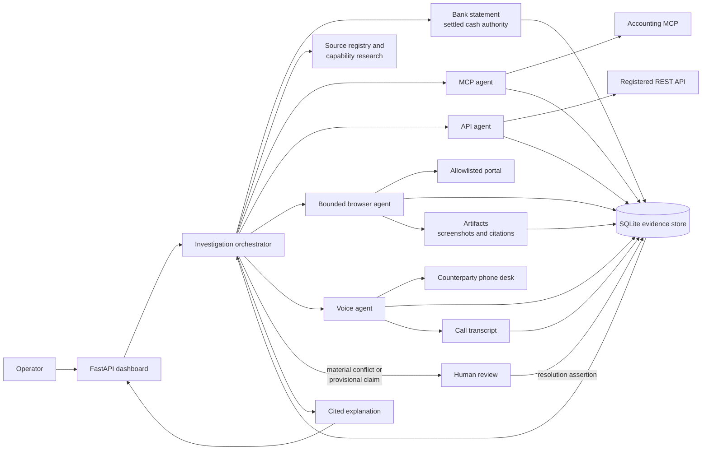

# Cashe

Evidence layer for the MONEY TALKS hackathon. Starts from an authoritative bank statement, then uses an LLM orchestrator to gather operational context from MCP, API, a bounded browser, and a voice caller.

Cashe answers questions such as *Why did cash decrease?* by working outward from settled bank activity. It gathers claim-level evidence from the best authorized source, keeps conflicting claims side by side, and pauses for a human when the records cannot safely be reconciled automatically.

## Agents

The orchestrator decides what evidence is missing and delegates acquisition to a narrowly scoped agent. The order MCP -> API -> browser -> voice is a preference for the first inquiry, not a fixed workflow; the orchestrator can use several agents when a fact needs corroboration.

| Agent | Responsibility | Tools and authority |
| --- | --- | --- |
| **Investigation orchestrator** | Loads the bank statement, identifies missing facts, researches available source capabilities, delegates collection, compares assertions, creates review packets, and writes the cited explanation. | Can inspect the source registry, use Tavily for capability research, spawn acquisition agents, and request human review. Tavily findings never become financial assertions. |
| **MCP agent** | Reads authoritative accounting records such as open invoices, expected receipts, customers, and invoice details. | Uses only the authorized accounting MCP operations. Accounting records are `BOOKS` authority. |
| **API agent** | Retrieves status, timelines, delays, and reasons from a registered financial system with a usable developer API. | Uses allowlisted read operations for API-entitled sources. |
| **Browser agent** | Finds records in authorized portals that do not expose a suitable API, then captures visible fields, timelines, citations, and screenshots. | Uses OpenAI for semantic action selection and Playwright for navigation. The host enforces exact origins, read-only paths, action budgets, identity checks, and completeness checks. Approved SOP memory is browser-only. |
| **Voice agent** | Calls a counterparty when no stronger digital record is available and returns the full transcript. | Uses the configured telephony provider. Voice claims have `COMMUNICATION` authority and remain provisional until corroborated or accepted by a human. |

Acquisition agents cannot create other agents or resolve disagreements. They return evidence to the orchestrator, which owns synthesis and escalation.

## Architecture



Every source result is stored as an artifact plus individual assertions with provenance and authority. Disagreement is retained rather than overwritten. A human resolution becomes a new assertion, so the final explanation can show exactly which evidence supports each claim.

The browser path is intentionally bounded: OpenAI chooses among visible, semantic actions, while application code controls which source, origin, route, query field, and HTTP method may be used. This makes it useful for financial portals and public-record systems without granting arbitrary web access. New portal types are added through a source-registry entry and a browser profile; see [Browser agent](docs/browser-agent.md).

## Run

```bash
uv sync
uv run playwright install chromium
uv run uvicorn cashe.main:app --host 127.0.0.1 --port 8000
```

Open http://127.0.0.1:8000 and ask why cash decreased in September.

Full investigation against Prism (records demo human resolutions when the agent escalates):

```bash
uv run python -m cashe.demo
```

## Config

Copy `.env.example` to `.env`. `TAVILY_API_KEY` and `PRISM_API_KEY` are required for live research and the orchestrator. Tavily falls back to the committed cache if the live call fails.

The browser agent uses OpenAI (`OPENAI_API_KEY`) and Playwright to read the configured portal, capture screenshots and visible text, verify invoice identity and completeness, and store cited workflow assertions. Approved browser SOPs retain successful semantic navigation and can be reused across label/layout changes. See [browser setup and verification](docs/browser-agent.md).

Voice uses the pizza-agent telephony stack (Vapi, Bland, Telnyx, or Twilio). `place_voice_call` f-strings the call purpose, dials `VOICE_TO_NUMBER`, and returns the full transcript to the voice subagent. Without telephony credentials it falls back to the HarborLine fixture.

There is no hard-coded source router. The orchestrator decides which subagents to spawn; tools only enforce read-only entitlements.
